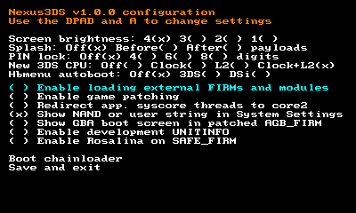
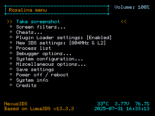

# Nexus3DS


*Nintendo 3DS "Custom Firmware" Fork with Enhanced Features*




## Description

**Nexus3DS** is an enhanced fork of Luma3DS that incorporates numerous community features and improvements. This project builds upon several Luma3DS forks, combining the best features while adding unique enhancements for an improved user experience.

**Key Features:**
* First-class support for homebrew applications
* **Rosalina** overlay menu with screenshots, cheat codes, input redirection, and more
* Game modding features (3GX plugins, LayeredFS, locale emulation)
* Support for custom system modules and patches
* Fully-fledged GDB stub for debugging
* Chainloading other firmware files

For detailed technical information, please refer to the [official Luma3DS documentation](https://github.com/LumaTeam/Luma3DS/wiki) and [README](https://github.com/LumaTeam/Luma3DS/blob/master/README.md).

## Installation and Requirements

**Nexus3DS** requires [boot9strap](https://github.com/SciresM/boot9strap) to run.

Currently, Nexus3DS is **source code only** - no pre-built releases are available. You must build from source (see [Building from source](#building-from-source) below). 

## Quick Start

1. Install [boot9strap](https://github.com/SciresM/boot9strap) on your 3DS
2. Build Nexus3DS from source (see [Building from source](#building-from-source))
3. Place the resulting `boot.firm` file on the root of your SD card
4. Configuration menu: Press <kbd>Select</kbd> at boot
5. Rosalina overlay menu: <kbd>L+Down+Select</kbd> (default combo)

**Basic Usage:**
- **Configuration menu**: Press <kbd>Select</kbd> at boot - config stored in `/luma/nexusconfig.ini`
- **Chainloader menu**: Press <kbd>Start</kbd> at boot - payloads go in `/luma/payloads/*.firm`
- **Rosalina menu**: <kbd>L+Down+Select</kbd>

## Building from source

**Prerequisites:**
* git
* [makerom](https://github.com/jakcron/Project_CTR) in `$PATH`
* [firmtool](https://github.com/TuxSH/firmtool) installed
* up-to-date devkitARM and libctru:
  * Install `dkp-pacman`: https://devkitpro.org/wiki/devkitPro_pacman
  * Install 3DS dev tools: `sudo dkp-pacman -S 3ds-dev --needed`

**Build steps:**
```bash
git clone https://github.com/2b-zipper/Nexus3DS.git
cd Nexus3DS
make
```

The build produces a single file: `boot.firm`. Copy it to the root of your SD card.

**Note:** For easy SD card file transfer, consider using [ftpd](https://github.com/mtheall/ftpd).

## Maintainers

**Original Luma3DS:**
* **[@TuxSH](https://github.com/TuxSH)**: lead developer, created and maintains most features of the project. Joined in 2016
* **[@AuroraWright](https://github.com/AuroraWright)**: author of the project, implemented the core features (most of the baremetal boot settings menu and firmware loading code) with successful design decisions that made the project popular. Created the project in 2015, currently inactive
* **[@PabloMK7](https://github.com/PabloMK7)**: maintainer of the plugin loader feature merged for the v13.0 release. Joined in 2023

**Nexus3DS:**
* **[@2b-zipper](https://github.com/2b-zipper)**
* **[@cooolgamer](https://github.com/cooolgamer)**

*See also: [People who made this fork possible](#credits)*

## Known Issues

**Luma3DS (inherited issues):**
* **Cheat engine crashes with some games** (especially Pokémon): Due to a race condition in Nintendo's Kernel11. Use dedicated game plugins as alternative.
* **Games may react to Rosalina button combo**: Change the combo in "Miscellaneous options" → "Save settings" to work around this.

**Nexus3DS specific:**
* No known major issues at this time. Please report any bugs on the [Issues page](https://github.com/2b-zipper/Nexus3DS/issues).

## Licensing
This software is licensed under the terms of the GPLv3. You can find a copy of the license in the LICENSE.txt file.

Files in the GDB stub are instead triple-licensed as MIT or "GPLv2 or any later version", in which case it's specified in the file header. PM, SM, PXI reimplementations are also licensed under MIT.

## Credits

Nexus3DS is based on the work of many talented developers from the original Luma3DS project and various community forks.

For a complete list of contributors and acknowledgments, please see the [official Luma3DS credits](https://github.com/LumaTeam/Luma3DS/blob/master/README.md#credits).

**People who made this fork possible (in no particular order):**
- **[@DullPointer](https://github.com/DullPointer)** - Additional features ([Source Repository](https://github.com/DullPointer/Luma3DS_archive))
- **[@Tekito-256](https://github.com/Tekito-256)** - Plugin Selector ([Source Repository](https://github.com/Tekito-256/Luma3DS))
- **[@Gruetzig](https://github.com/Gruetzig)** - Playcoin maxing ([Source Repository](https://github.com/Gruetzig/Luma3DS))
- **[@cooolgamer](https://github.com/cooolgamer)** - Power options ([Source Repository](https://github.com/cooolgamorg/CustomLuma3DS))
- **[@JBMagination2](https://github.com/JBMagination2)** - Rosalina menu time ([Source Repository](https://github.com/JBMagination2/Luma3DS))
- **[@Pixel-Pop](https://github.com/Pixel-Pop)** - Logo.bin loader ([Source Repository](https://github.com/Pixel-Pop/Luma3DS))

---

**For detailed documentation, troubleshooting, and comprehensive information, please visit the [official Luma3DS repository](https://github.com/LumaTeam/Luma3DS) and [wiki](https://github.com/LumaTeam/Luma3DS/wiki).**
