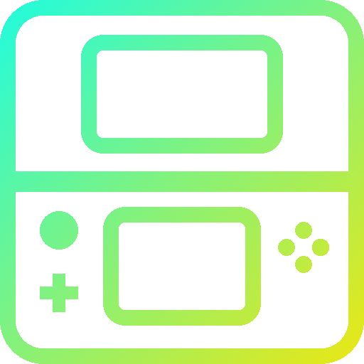

<div align="center">



# Nexus3DS

<p align="center">
  <em>Nintendo 3DS "Custom Firmware" Fork with Enhanced Features</em>
</p>

<p align="center">
  <a href="https://github.com/2b-zipper/Nexus3DS/releases"></a>
  <a href="LICENSE"></a>
  <a href="https://github.com/2b-zipper/Nexus3DS/releases/latest"></a>
  <a href="https://discord.gg/StUs5bsw2S"></a>
</p>

<p align="center">
  <a href="https://github.com/LumaTeam/Luma3DS"></a>
  <a href="https://github.com/SciresM/boot9strap"></a>
</p>

</div>

<div align="center">

## Screenshots

| Configuration Menu | Rosalina Menu |
|:------------------:|:-------------:|
|  |  |

</div>

## Description

**Nexus3DS** is an enhanced fork of Luma3DS that incorporates numerous community features and improvements. This project builds upon several Luma3DS forks, combining the best features while adding unique enhancements for an improved user experience.

## Limitations
**CTGP7**, does not, and never will, work with Nexus3DS.

The reason why is because there is an anti-cheat which prevent the use of Luma3DS forks. Which is a good thing to make sure the CTGP network is safe from cheaters.

**DO NOT BLAME PABLOMK7 FOR THIS**. We won't ask him to do something about this (such as whitelisting our firm), since he's already working on a ton of things, and adding that also mean taking responsibilities and such, and we don't want to disturb him for this. Thank for your understanding.

**Workaround**: you can use Luma's [Firm Payload Chainloader](https://github.com/LumaTeam/Luma3DS/wiki/Optional-features#firm-payload-chainloader) feature to be able to quickly cholse to boot between Nexus3DS and Luma3DS depending of your needs. The best way would be to use [Fastboot3DS](https://github.com/derrekr/fastboot3DS/releases) allowing you to configure the boot order, buttons and such.

## Enhanced Features

**Core Enhancements:**
* Changed the configuration file name from `config.ini` to `nexusconfig.ini` to prevent conflicts with official Luma3DS
* Modified Configuration menu and Rosalina menu colors and layout
* Set the number of Play Coins - *Original by [Gruetzig](https://github.com/Gruetzig/Luma3DS/commit/1e329b55dade61ba74a0bb1cc6e59d2504d0bde1)*
* Plugin selector - *Original by [Tekito-256](https://github.com/Tekito-256/Luma3DS)*  
  > **Note:** To access the plugin selector after setting a default plugin, hold the **Select** button while launching a game
* Plugin Watcher - *Original by [Tekito-256](https://github.com/Tekito-256/Luma3DS)*  
  > **Note:** Monitors and alerts on potentially sensitive plugin operations (file/directory deletion, network connections, camera access). When enabled, displays a confirmation dialog allowing you to continue or block the operation
* Support for v0.5.x 3GX plugin loading - *Original by [Tekito-256](https://github.com/Tekito-256/Luma3DS)*
* Force reboot option - *Original by [cooolgamer](https://github.com/cooolgamer)*
* Time display in Rosalina menu - *Original by [suprdratts/hide0123](https://github.com/suprdratts/Luma3DS/commit/766173d65eeb52baac90e9e68b456ad93ebaab7b)*
* Logo.bin loading feature - *Original by [Pixel-Pop](https://github.com/Pixel-Pop/Luma3DS/commit/d225d9fa507dcccce3a6c86d0a38f7998f39b7a2)*
* Detailed screen brightness adjustment - *Original by [DullPointer](https://github.com/DullPointer/Luma3DS/commit/83e8d471a377bc6960fae00d6694f5fe86dcca42)*
* Volume display in Rosalina menu - *Original by [DullPointer](https://github.com/DullPointer/Luma3DS_archive/commit/dc636d82492d1e87eb51785fa7f2a98617e7ece9)*
* N3DS clock + L2 status display in Rosalina menu - *Original by [DullPointer](https://github.com/DullPointer/Luma3DS/commit/2dbfa8b5c9b719b7f3056691f54332f42da6de8d)*

* Title ID display in System info

* **HOME button simulation options** in Rosalina menu:
  * Toggle visibility of "Return to HOME Menu" option (useful if your HOME button is broken)
  * Enable/disable HOME button combo simulation
  * Configure key combo to simulate HOME button press  
  > **Note:** HOME button key combo only works inside applications, not on HOME Menu
* Merged "Enable DSi external filters" option into "Enable loading external FIRMs and modules" option in configuration menu
* Restored "Enable dev UNITINFO" and "Enable Rosalina on SAFE_FIRM" options in configuration menu
* Re-added splash duration setting option in configuration menu (custom values also supported)
* Added no errdisp + instant reboot option - Press A+B+X+Y+Start to instantly reboot  
  > **Note:** Configurable via `nexusconfig.ini` only. Using instant reboot may corrupt your SD card
* Day/Night mode allowing to change the brightness, toggle LEDs, etc. At a desired time - *Original by [cooolgamer](https://github.com/cooolgamorg/Starlight3DS/commit/d0eb60bc21f464e7269dc7b93416e89423232de9) based on [DullPointer](https://github.com/DullPointer/Luma3DS_archive/commit/54cdedce2a55b8deae730d0af077ee2907f0444b)*
* Random little messages in the arm11/9 exception handler :)
* Screenshots include title ID in filename

**Extra Configuration Menu Options:**
* Automatically suppress LEDs - *Original by [DullPointer](https://github.com/DullPointer/Luma3DS/commit/174ed486ab59bd249488c9035682fa7d058d1e80)*
* Cut power to TWL Flashcards - *Original by [DullPointer](https://github.com/DullPointer/Luma3DS/commit/174ed486ab59bd249488c9035682fa7d058d1e80)*
* Cut 3DS Wifi in sleep mode - *Original by [DullPointer](https://github.com/DullPointer/Luma3DS/commit/174ed486ab59bd249488c9035682fa7d058d1e80)*
* Save screenshots in date folders
* Combine top/bottom screenshots (saved with _cmb suffix)
* Toggle bottom LCD backlight with Start+Select
* Use Fahrenheit for temperature display (defaults to Celsius)
* Use 12-hour clock format in Rosalina menu (defaults to 24-hour)

For detailed technical information, please refer to the [official Luma3DS documentation](https://github.com/LumaTeam/Luma3DS/wiki) and [README](https://github.com/LumaTeam/Luma3DS/blob/master/README.md).

## Installation and Requirements

**Nexus3DS** requires [boot9strap](https://github.com/SciresM/boot9strap) to run.

Once boot9strap has been installed, simply download the latest `boot.firm` file from the [releases page](https://github.com/2b-zipper/Nexus3DS/releases/latest) and place it on the root of your SD card to "install" or upgrade Nexus3DS. Replace any existing `boot.firm` file if necessary.

To build from source, see [Building from source](#building-from-source) below.

## Quick Start

1. Install [boot9strap](https://github.com/SciresM/boot9strap) on your 3DS
2. Build Nexus3DS from source (see [Building from source](#building-from-source))
3. Place the resulting `boot.firm` file on the root of your SD card
4. Configuration menu: Press <kbd>Select</kbd> at boot
5. Rosalina overlay menu: <kbd>L+Down+Select</kbd> (default combo)

**Basic Usage:**
- **Configuration menu**: Press <kbd>Select</kbd> at boot - config stored in `/luma/nexusconfig.ini`
- **Chainloader menu**: Press <kbd>Start</kbd> at boot - payloads go in `/luma/payloads/*.firm`
- **Rosalina menu**: <kbd>L+Down+Select</kbd> (default combo)
- **Home button simulation**: <kbd>R+Select</kbd> (default combo, if enabled in settings)

## Building from source

**Prerequisites:**
* git
* [makerom](https://github.com/jakcron/Project_CTR) in `$PATH`
* [firmtool](https://github.com/TuxSH/firmtool) installed
* up-to-date devkitARM and libctru:
  * Install `dkp-pacman`: https://devkitpro.org/wiki/devkitPro_pacman
  * Install 3DS dev tools: `sudo dkp-pacman -S 3ds-dev --needed`

**Build steps:**
```bash
git clone https://github.com/2b-zipper/Nexus3DS.git
cd Nexus3DS
make
```

The build produces a single file: `boot.firm`. Copy it to the root of your SD card.

**Note:** For easy SD card file transfer, consider using [ftpd](https://github.com/mtheall/ftpd).

## Maintainers

**Original Luma3DS:**
* **[@TuxSH](https://github.com/TuxSH)**: lead developer, created and maintains most features of the project. Joined in 2016
* **[@AuroraWright](https://github.com/AuroraWright)**: author of the project, implemented the core features (most of the baremetal boot settings menu and firmware loading code) with successful design decisions that made the project popular. Created the project in 2015, currently inactive
* **[@PabloMK7](https://github.com/PabloMK7)**: maintainer of the plugin loader feature merged for the v13.0 release. Joined in 2023

**Nexus3DS:**
* **[@2b-zipper](https://github.com/2b-zipper)**
* **[@cooolgamer](https://github.com/cooolgamer)**
* **[@Alexyo21](https://github.com/Alexyo21)**

*See also: [People who made this fork possible](#credits)*

## Known Issues

**Luma3DS (inherited issues):**
* **Cheat engine crashes with some games** (especially Pokémon): Due to a race condition in Nintendo's Kernel11. Use dedicated game plugins as alternative.
* **Games may react to Rosalina button combo**: Change the combo in "Miscellaneous options" → "Save settings" to work around this.

**Nexus3DS specific:**
* No known major issues at this time. Please report any bugs on the [Issues page](https://github.com/2b-zipper/Nexus3DS/issues).

## Licensing
This software is licensed under the terms of the GPLv3. You can find a copy of the license in the LICENSE.txt file.

Files in the GDB stub are instead triple-licensed as MIT or "GPLv2 or any later version", in which case it's specified in the file header. PM, SM, PXI reimplementations are also licensed under MIT.

## Credits

Nexus3DS is based on the work of many talented developers from the original Luma3DS project and various community forks.

For a complete list of contributors and acknowledgments, please see the [official Luma3DS credits](https://github.com/LumaTeam/Luma3DS/blob/master/README.md#credits).

**People who made this fork possible (in no particular order):**
- **[@DullPointer](https://github.com/DullPointer)** - Additional features ([Source Repository](https://github.com/DullPointer/Luma3DS_archive))
- **[@Tekito-256](https://github.com/Tekito-256)** - Plugin Selector ([Source Repository](https://github.com/Tekito-256/Luma3DS))
- **[@Gruetzig](https://github.com/Gruetzig)** - Playcoin maxing ([Source Repository](https://github.com/Gruetzig/Luma3DS))
- **[@cooolgamer](https://github.com/cooolgamer)** - Power options ([Source Repository](https://github.com/cooolgamorg/CustomLuma3DS))
- **[@suprdratts](https://github.com/suprdratts)** - Rosalina menu time (by [@hide0123](https://github.com/hide0123)) ([Source Repository](https://github.com/suprdratts/Luma3DS))
- **[@Pixel-Pop](https://github.com/Pixel-Pop)** - Logo.bin loader ([Source Repository](https://github.com/Pixel-Pop/Luma3DS))

---

**For detailed documentation, troubleshooting, and comprehensive information, please visit the [official Luma3DS repository](https://github.com/LumaTeam/Luma3DS) and [wiki](https://github.com/LumaTeam/Luma3DS/wiki).**
